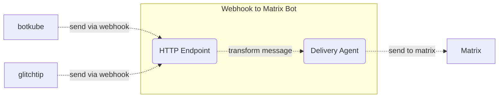

# Webhook to Matrix Bot

This little Golang bot/server listens to a webhook and sends the received data to a Matrix room.

## How to setup:

- Clone repo: `git clone https://github.com/l3montree-dev/webhook-to-matrix.git`
- Create Matrix User if you don't have one already - e.g. using [Element](https://element.io/):
  - Logout of existing account if necessary and create a "normal" new account
  - Login to the new account and generate a recovery key (e.g. start a chat with another user -> element will ask to store the key)
  - Generate access token for user
    - `curl -X POST -H 'Content-Type: application/json' -d '{ "type":"m.login.password", "user":"username", "password":"password" }' "https://matrix.org/_matrix/client/r0/login"`
- Setup config file (`cp .env.example .env`) and adjust the variables in the `.env` file
- Run the server
  - Directly via `Go`: `go run main.go`
  - Docker: `docker build -t webhook-to-matrix . && docker run --rm -p 5001:5001 -v $(pwd)/.env:/app/.env:ro webhook-to-matrix`
  - Helm: TBD
- Setup apps (e.g. Glitchtip / Botkube / ...) to send data to the bot. E.g.:
  - `http://your-domain.com/webhook/my-webhook-secret/glitchtip?roomid=xyz` [Docs](https://glitchtip.com/documentation/error-tracking#turn-on-alerts)
  - `http://your-domain.com/webhook/my-webhook-secret/botkube?roomid=xyz` [Docs](https://docs.botkube.io/installation/webhook/)

## Architecture 

## Supported Applications

